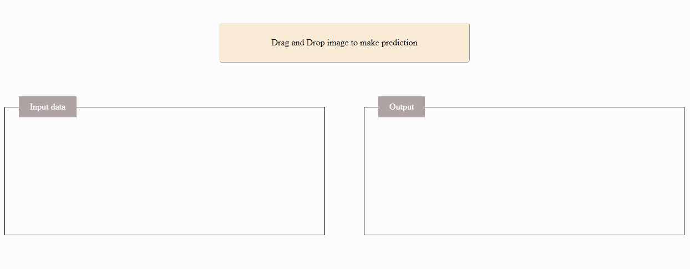
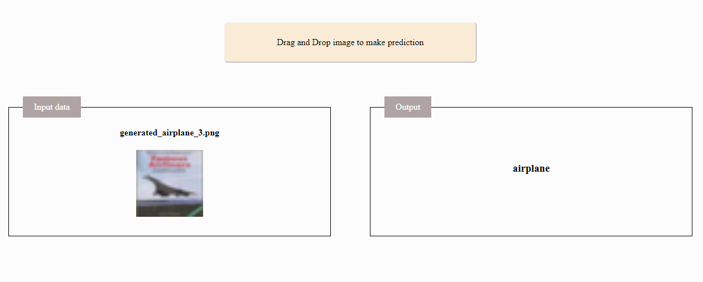

# CIFAR Image classification 

In this branch, we aim to provide a deep learning workflow to classify images in the CIFAR-10 dataset using Keras. 

## Setup
``pip install -r requirement.txt``

* #### Tensorflow implementation [Working on it]
Using Vanilla Tensorflow to build the classifier. check <a href='https://github.com/mhannani/CIFAR-10_classification/tree/Tensorflow'>here</a>

* #### PyTorch implementation [Working on it]
Using PyTorch to build the classifier. check <a href='https://github.com/mhannani/CIFAR-10_classification/tree/PyTorch'>here</a>

* #### The UI using Dash Plotly [Working on it]
Web application using Dash plotly providing the pretrained model in production. check <a href='https://github.com/mhannani/CIFAR-10_classification/tree/UI'>here</a>

## Dash plotly interface for image classification

The ANN was trained on cifar_10 dataset with shape (None, 32, 32, 3), with None for the batch size.

After prediction

